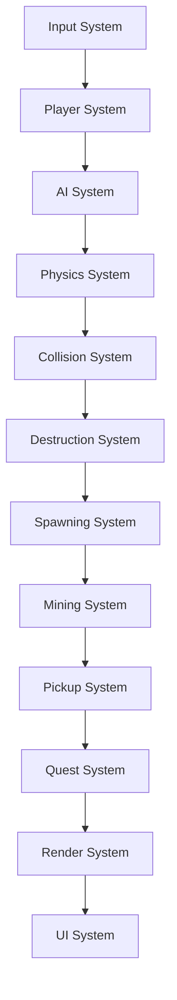
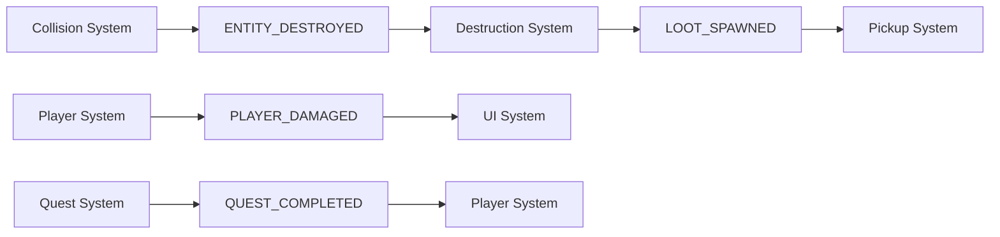

# Systems Guide - Novus Space Game

This document provides detailed information about all game systems, their interactions, and how to modify or extend them.

## Table of Contents

1. [System Overview](#system-overview)
2. [Core Systems](#core-systems)
3. [Gameplay Systems](#gameplay-systems)
4. [Rendering Systems](#rendering-systems)
5. [UI Systems](#ui-systems)
6. [Support Systems](#support-systems)
7. [System Interactions](#system-interactions)

## System Overview

The game is organized into several categories of systems:

- **Core Systems**: Essential game functionality (physics, collision, rendering)
- **Gameplay Systems**: Game mechanics (combat, mining, quests)
- **Rendering Systems**: Visual output and effects
- **UI Systems**: User interface and interaction
- **Support Systems**: Utilities and infrastructure

## Core Systems

### 1. Physics System (`src/systems/physics.lua`)

**Purpose**: Handles movement, velocity, and basic physics simulation.

**Key Functions**:
- Updates entity positions based on velocity
- Applies thruster forces (for non-player entities)
- Manages physics body properties

**Dependencies**: Position, Velocity, Physics components

**Update Order**: Early in frame (after input, before collision)

```lua
-- Example usage
PhysicsSystem.update(dt, world:getEntities())
```

### 2. Collision System (`src/systems/collision/`)

**Purpose**: Detects and handles collisions between entities.

**Components**:
- `core.lua`: Main collision detection logic
- `entity_collision.lua`: Entity-to-entity collisions
- `projectile_collision.lua`: Projectile hit detection
- `radius.lua`: Circular collision detection
- `station_shields.lua`: Station shield interactions

**Key Features**:
- Quadtree-based spatial partitioning
- Damage application and health updates
- Collision response and effects
- Shield system integration
- Mirrors collidable entities into an optional Windfield world (`src/core/windfield_world.lua`) for physics experiments and contact debugging

**Dependencies**: Collidable, Health, Position components

### 3. Boundary System (`src/systems/boundary_system.lua`)

**Purpose**: Manages world boundaries and entity containment.

**Key Functions**:
- Prevents entities from leaving world bounds
- Handles boundary collision responses
- Manages world wrapping (if enabled)

**Dependencies**: Position, Velocity components

### 4. Destruction System (`src/systems/destruction.lua`)

**Purpose**: Handles entity death and cleanup.

**Key Functions**:
- Processes dead entities
- Spawns wreckage and loot
- Triggers death events
- Manages entity cleanup

**Dependencies**: Health, Position components

**Events Emitted**:
- `ENTITY_DESTROYED`: When an entity is destroyed
- `PLAYER_DIED`: When player dies
- `LOOT_SPAWNED`: When loot is created

## Gameplay Systems

### 1. Player System (`src/systems/player.lua`)

**Purpose**: Handles all player-specific logic and input processing.

**Key Functions**:
- Processes player input (movement, combat, abilities)
- Manages player abilities (boost, shield, dash)
- Handles player state transitions
- Updates player-specific UI elements

**Dependencies**: Player entity, Input system, World

**Player Abilities**:
- **Movement**: WASD/Arrow keys for movement
- **Boost**: Sustained thrust with energy cost
- **Shield**: Damage reduction with channeling
- **Dash**: Quick movement with invulnerability frames

### 2. AI System (`src/systems/ai.lua`)

**Purpose**: Controls enemy ship behavior and decision making.

**AI States**:
- **Idle**: Patrol or wait for targets
- **Hunting**: Pursue and attack targets
- **Retreating**: Flee when low on health

**Key Functions**:
- Target acquisition and tracking
- State machine management
- Combat behavior execution
- Energy management

**Dependencies**: AI, Position, Velocity, Health components

**AI Behavior Patterns**:
```lua
-- Target finding
local function findTarget(entity, world)
    -- Find nearest player or friendly entity
end

-- State handling
if ai.state == "hunting" then
    handleHuntingState(entity, dt, world, spawnProjectile)
end
```

### 3. Spawning System (`src/systems/spawning.lua`)

**Purpose**: Manages enemy and entity spawning.

**Key Functions**:
- Spawns enemies based on difficulty
- Enforces safe zones around stations
- Manages spawn timing and intervals
- Handles difficulty scaling

**Spawn Rules**:
- No spawning within station safe zones
- Minimum distance from player
- Respects maximum enemy limits
- Difficulty-based spawn rates

### 4. Mining System (`src/systems/mining.lua`)

**Purpose**: Handles asteroid mining and resource extraction.

**Key Functions**:
- Processes mining laser interactions
- Manages mining progression
- Spawns extracted resources
- Handles mining tool requirements

**Mining Mechanics**:
- Different asteroids have different resources
- Mining tools have different effectiveness
- Resources spawn as collectible items
- Mining progression is tracked per asteroid

### 5. Pickup System (`src/systems/pickups.lua`)

**Purpose**: Manages item collection and inventory management.

**Key Functions**:
- Detects item pickups
- Handles magnetic collection
- Updates player inventory
- Manages pickup effects

**Pickup Types**:
- **Magnetic**: Automatically drawn to player
- **Manual**: Require player interaction
- **Loot**: Dropped from destroyed entities

### 6. Quest System (`src/systems/quest_system.lua`)

**Purpose**: Manages quests, missions, and objectives.

**Key Functions**:
- Tracks quest progress
- Handles quest completion
- Manages quest rewards
- Generates procedural quests

**Quest Types**:
- **Kill Quests**: Destroy specific enemies
- **Mining Quests**: Collect specific resources
- **Delivery Quests**: Transport items
- **Exploration Quests**: Visit locations

**Quest Events**:
```lua
Events.on(Events.GAME_EVENTS.ENTITY_DESTROYED, function(data)
    QuestSystem.handleEntityDestroyed(data)
end)
```

### 7. Turret System (`src/systems/turret/`)

**Purpose**: Manages weapon systems and combat mechanics.

**Key Components**:
- `core.lua`: Main turret logic and initialization
- `projectile_weapons.lua`: Handles projectile weapon firing
- `beam_weapons.lua`: Handles hitscan beam weapons
- `utility_beams.lua`: Handles mining and salvaging lasers
- `heat_manager.lua`: Manages weapon overheating

**Streamlined Turret System**:
- **5 Core Turrets**: Combat Laser, Gun Turret, Missile Launcher, Mining Laser, Salvaging Laser
- **Embedded Projectiles**: Each turret contains its own projectile definition
- **No Targeting**: All weapons fire in shot direction only - no homing or guidance
- **Directional Combat**: Weapons aim at cursor (player) or ship facing (AI)

**Key Functions**:
- Turret initialization and configuration
- Weapon firing and projectile spawning
- Heat management and overheating
- Visual effects and audio

**Dependencies**: Position, Velocity, Physics, Equipment components

### 8. Repair System (`src/systems/repair_system.lua`)

**Purpose**: Handles ship repair and maintenance.

**Key Functions**:
- Processes repair requests
- Manages repair costs and time
- Updates ship health and modules
- Handles repair station interactions

### 9. Node Market System (`src/systems/node_market.lua`)

**Purpose**: Manages the trading node simulation and stock market.

**Key Functions**:
- Simulates market price fluctuations
- Handles buy/sell orders
- Manages portfolio tracking
- Generates market data

**Market Features**:
- Real-time price updates
- Technical analysis indicators
- Portfolio management
- Trading history

## Rendering Systems

### 1. Main Render System (`src/systems/render.lua`)

**Purpose**: Coordinates all rendering operations.

**Key Functions**:
- Manages render order
- Coordinates entity rendering
- Handles special effects
- Manages UI overlay

### 2. Entity Renderers (`src/systems/render/entity_renderers.lua`)

**Purpose**: Renders different types of entities.

**Entity Types**:
- Ships (player and AI)
- Projectiles
- World objects (stations, asteroids)
- Effects and particles

**Rendering Features**:
- Sprite batching for performance
- Visual effects and animations
- Damage indicators
- Shield visualization

### 3. Player Renderer (`src/systems/render/player_renderer.lua`)

**Purpose**: Specialized rendering for player ship.

**Key Features**:
- Player-specific visual effects
- Targeting reticle
- Thruster effects
- Shield visualization

### 4. Effects System (`src/systems/effects.lua`)

**Purpose**: Manages visual effects and particles.

**Effect Types**:
- Explosions
- Engine trails
- Shield impacts
- Mining effects

## UI Systems

### 1. UI Manager (`src/core/ui_manager.lua`)

**Purpose**: Central coordination of all UI elements.

**Key Functions**:
- Manages UI panel visibility
- Handles input routing
- Coordinates panel interactions
- Manages UI state

### 2. HUD System (`src/ui/hud/`)

**Purpose**: In-game heads-up display.

**Components**:
- **Status Bars**: Health, energy, shields
- **Minimap**: World overview
- **Quest Log**: Active mission display
- **Hotbar**: Quick actions

### 3. Docked Interface (`src/ui/docked.lua`)

**Purpose**: Main interface when docked at stations.

**Tabs**:
- **Shop**: Buy/sell items and ships
- **Ship**: Equipment and customization
- **Quests**: Mission management
- **Nodes**: Trading interface

### 4. Inventory System (`src/ui/inventory.lua`)

**Purpose**: Item and equipment management.

**Features**:
- Item grid display
- Drag and drop functionality
- Equipment slots
- Item tooltips

## Support Systems

### 1. Event System (`src/core/events.lua`)

**Purpose**: Decoupled communication between systems.

**Key Functions**:
- Event emission and listening
- Event queuing and processing
- Event debugging and logging

### 2. Sound System (`src/core/sound.lua`)

**Purpose**: Audio management and playback.

**Features**:
- Music and SFX playback
- Distance-based volume attenuation
- Sound event triggers
- Audio settings management

### 3. State Manager (`src/managers/state_manager.lua`)

**Purpose**: Save/load game state.

**Key Functions**:
- Serializes game state
- Handles save/load operations
- Manages auto-save
- Version compatibility

### 4. Multiplayer System (`src/core/multiplayer.lua`)

**Purpose**: Network synchronization and multiplayer support.

**Features**:
- Player synchronization
- Event broadcasting
- Connection management
- State reconciliation

### 5. Action Map (`src/core/action_map.lua`)

**Purpose**: Centralizes keyboard shortcuts and contextual actions so gameplay and UI teams can add behaviors without editing the low-level input loop.

**Key Concepts**:
- **Action Descriptors**: Each action is registered through `ActionMap.registerAction` with a descriptor that defines a `name`, how to read bound keys (`getKeys`), an optional `enabled` predicate, and the `callback` that performs the work.
- **Settings Integration**: Use `Settings.getBinding("action_name")` or `ActionMap.bindingKeys("action_name")` to resolve default/user-assigned keys. `Settings.setKeyBinding` updates the stored binding, and `Settings.getKeymap()` still returns the flattened table for legacy UI.
- **Execution Context**: `src/core/input.lua` constructs a context containing the active `player`, `world`, `UIManager`, `Events`, `notifications`, `util`, and injected services (e.g., `repairSystem`). `ActionMap.dispatch` passes this context into callbacks so they can call high-level facades instead of requiring UI modules directly.

**Registering a New Action**:
1. **Declare a Binding** – Add a default entry in `Settings` (e.g., `settings.keymap.new_action = { primary = "k" }`). Expose it through `Settings.getBinding` if other systems need to inspect it.
2. **Register the Descriptor** – Extend `src/core/action_map.lua` (or require it from a feature module) and call `ActionMap.registerAction({ name = "new_action", getKeys = function() return ActionMap.bindingKeys("new_action") end, callback = function(ctx) ... end })`.
3. **Use Facades** – Inside the callback, prefer `ctx.UIManager`, `ctx.Events`, or other injected services. If you need additional data, modify `Input.keypressed` to pass it through the context rather than requiring new modules inside the action.
4. **Prioritize & Guard** – Set `priority` when multiple actions share keys and add an `enabled` predicate to short-circuit actions when the relevant context is missing.

This structure allows teams to introduce new shortcuts or interaction contexts by working in the action map, keeping `input.lua` focused on wiring and state handoff.

## System Interactions

### Update Flow



### Event Flow



### Data Dependencies

- **World State**: Shared between all systems
- **Player Entity**: Referenced by most systems
- **Event System**: Used for decoupled communication
- **Content System**: Provides data for entity creation

### Performance Considerations

- **System Order**: Optimized for data locality
- **Entity Filtering**: Only process relevant entities
- **Spatial Indexing**: Use quadtree for efficient queries
- **Event Batching**: Process events in batches

---

This systems guide provides detailed information about each game system and how they interact. For specific implementation details, refer to the individual source files and their inline documentation.
