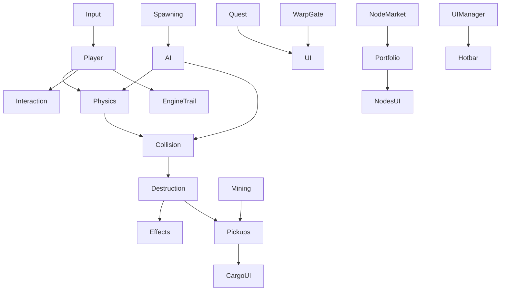
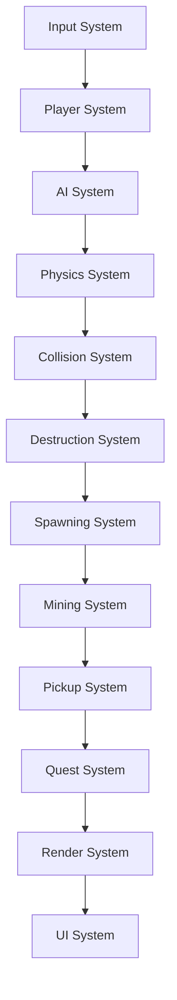
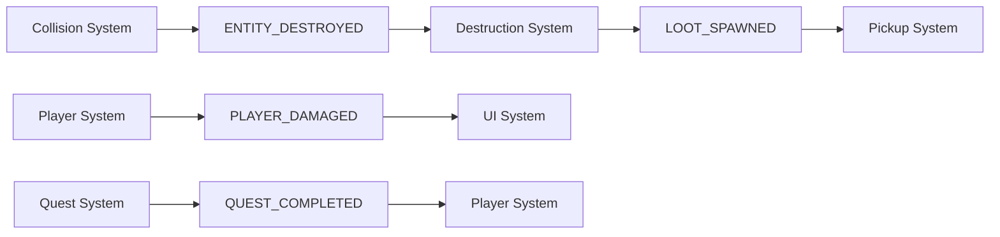

# Systems Guide - Novus Space Game

This guide describes the gameplay and support systems that power Novus. Use it as a reference when extending functionality or debugging interactions between subsystems. The content below merges the historical reference that previously lived at the repository root with the curated highlights that now live in `docs/`, providing a single canonical source of truth.

## Table of Contents

1. [System Overview](#system-overview)
2. [Frame Update Order](#frame-update-order)
3. [Core Simulation Systems](#core-simulation-systems)
    - [Physics System](#physics-system-srcsystemsphysicslua)
    - [Collision System](#collision-system-srcsystemscollision)
    - [Projectile Framework](#projectile-framework-srctemplatesprojectilelua)
    - [Boundary System](#boundary-system-srcsystemsboundary_systemlua)
    - [Destruction System](#destruction-system-srcsystemsdestructionlua)
4. [Gameplay Systems](#gameplay-systems)
    - [Player System](#player-system-srcsystemsplayerlua)
    - [AI System](#ai-system-srcsystemsailua)
    - [Turret Systems](#turret-systems-srcsystemsturret)
    - [Spawning System](#spawning-system-srcsystemsspawninglua)
    - [Mining System](#mining-system-srcsystemsmininglua)
    - [Pickup System](#pickup-system-srcsystemspickupslua)
    - [Interaction System](#interaction-system-srcsystemsinteractionlua)
    - [Repair System](#repair-system-srcsystemsrepair_systemlua)
    - [Hub & Station System](#hub--station-system-srcsystemshublua)
    - [Quest System](#quest-system-srcsystemsquest_systemlua)
    - [Node Market](#node-market-srcsystemsnode_marketlua)
    - [Warp Gate System](#warp-gate-system-srcsystemswarp_gate_systemlua)
5. [Rendering & Effects](#rendering--effects)
    - [Render System](#render-system-srcsystemsrenderlua)
    - [Entity Renderers](#entity-renderers-srcsystemsrenderentity_rendererslua)
    - [Player Renderer](#player-renderer-srcsystemsrenderplayer_rendererlua)
    - [Effects System](#effects-system-srcsystemseffectslua)
    - [Engine Trail System](#engine-trail-system-srcsystemsengine_traillua)
6. [UI & Input Systems](#ui--input-systems)
    - [Input](#input-srccoreinputlua)
    - [UIManager](#uimanager-srccoreui_managerlua)
    - [Docked Interface](#docked-interface-srcuidockedlua)
    - [HUD Systems](#hud-systems-srcuihud)
    - [Cargo System](#cargo-system-srcuicargopanellua)
7. [Support Services](#support-services)
    - [Events](#events-srccoreeventslua)
    - [State Manager](#state-manager-srcmanagersstate_managerlua)
    - [Portfolio Manager](#portfolio-manager-srcmanagersportfoliolua)
    - [Sound System](#sound-system-srccoresoundlua)
    - [Multiplayer System](#multiplayer-system-srccoremultiplayerlua)
    - [Action Map](#action-map-srccoreaction_maplua)
    - [Theme & Settings](#theme--settings-srccorethemelua-srccoresettingslua)
8. [System Interactions](#system-interactions)

## System Overview

Systems consume entities, services, and content to drive the game loop. They are grouped broadly as:

- **Core Simulation** – Physics, collisions, projectiles, boundaries, and destruction.
- **Gameplay** – Player control, AI, spawning, mining, pickups, quests, economy, warp gates, and station services.
- **Rendering & Effects** – Visual presentation of the world and transient effects.
- **UI & Input** – HUD panels, modal windows, action maps, and input dispatch.
- **Support Services** – State management, audio, events, portfolios, multiplayer, and utilities that other systems rely on.

## Frame Update Order

`src/game.lua` orchestrates systems every frame in the following order (after early UI updates and pause checks):

1. **PlayerSystem.update** – Processes movement, dash/boost, turret firing, and warp readiness for the player entity.
2. **Sound Listener Update** – Positions the listener at the player for positional SFX.
3. **AISystem.update** – Advances enemy behavior states, targeting, and attack logic.
4. **PhysicsSystem.update** – Integrates velocities and applies thruster forces.
5. **ProjectileLifecycle.update** – Expires timed projectiles and capped-range ordnance.
6. **BoundarySystem.update** – Prevents entities leaving world bounds.
7. **CollisionSystem:update** – Detects entity/projectile collisions and applies damage/shields.
8. **DestructionSystem.update** – Handles entity death, loot spawning, and cleanup hooks.
9. **SpawningSystem.update** – Spawns enemy waves and enforces safe zones around stations.
10. **RepairSystem.update** – Allows repair beacon interactions near damaged stations.
11. **SpaceStationSystem.update** – Maintains docking state, station services, and hub timers.
12. **MiningSystem.update** – Progresses mining beams and awards ore.
13. **Pickups.update** – Applies magnetic collection to nearby loot crates and rewards.
14. **InteractionSystem.update** – Manages context prompts (dock, warp, interact) and handles queued actions.
15. **EngineTrailSystem.update** – Updates engine trail emitters from player thruster state.
16. **Effects.update** – Advances transient visual effects.
17. **QuestSystem.update** – Tracks quest objectives, completion, and rewards.
18. **NodeMarket.update** – Simulates node price movement and processes queued orders.
19. **WarpGateSystem.updateWarpGates** – Handles warp gate charge timers and unlocks.
20. **camera:update** – Follows the player and applies shake/zoom.
21. **world:update** – Removes dead entities and performs end-of-frame cleanup.
22. **StateManager.update** – Advances autosave timers and writes saves when necessary.
23. **refreshDockingState** – Re-evaluates docking eligibility for stations near the player.
24. **Events.processQueue** – Flushes queued events for deferred processing.
25. **HotbarSystem.update** – Updates ability cooldowns, manual turret firing, and UI bindings.

UI elements (`StatusBars`, `SkillXpPopup`, `Theme` animations) are updated before the player system runs, and rendering occurs later via `RenderSystem.draw` and UI manager draw calls.

## Core Simulation Systems

### Physics System (`src/systems/physics.lua`)

* Integrates positions using accumulated forces and velocities.
* Supports thruster forces, drag, and clamps for maximum speed.
* Requires `position`, `velocity`, and optional `physics` components.

**Purpose**: Handles movement, velocity integration, and overall physics simulation for the world.

**Key Functions**:
- Updates entity positions based on velocity and `dt`.
- Applies thrust, drag, and braking curves to match ship handling.
- Maintains clamps for maximum velocity and acceleration.
- Provides hooks for gameplay systems that need to inject impulses.

**Dependencies**: Position, Velocity, and optional Physics components. Runs early in the frame (after input, before collision processing) to provide fresh motion data to dependent systems.

### Collision System (`src/systems/collision/`)

* Uses quadtree-assisted broad-phase queries when available.
* Resolves entity/entity, projectile/entity, and radius-based interactions.
* Applies damage, shields, and triggers collision callbacks (loot spawning, death events).
* Emits projectile lifecycle events enriched with world context so behaviors can react (bounces, splits, homing updates).

**Purpose**: Detects and handles collisions between entities, projectiles, and world volumes.

**Key Components**:
- `core.lua`: Central collision orchestration.
- `entity_collision.lua`: Entity-to-entity resolution.
- `projectile_collision.lua`: Projectile hit detection and damage application.
- `radius.lua`: Circular collision queries for abilities and area effects.
- `station_shields.lua`: Specialized logic for station defenses.

**Notable Features**:
- Broad-phase spatial partitioning to reduce pair checks.
- Damage, shield, and invulnerability checks baked into resolution.
- Optional mirroring into `src/core/windfield_world.lua` for debugging alternate physics backends.
- Event emission that powers destruction, quest tracking, and pickup spawning.

**Dependencies**: Collidable, Health, Position components plus projectile metadata for hit logic.

### Projectile Framework (`src/templates/projectile.lua`)

* Projectiles are assembled from modular components, effects, and behaviors.
* `BehaviorManager` consumes the `behaviors` list on a projectile definition and wires handlers for spawn/update/hit/expire events (e.g., homing, bouncing, splitting, area denial fields).
* `RendererFactory` maps high-level `renderer` keys to specialized visual styles (energy, kinetic, missile, beam, area field) while keeping legacy `renderable` data compatible.
* Event payloads include the owning `world` and `keepAlive` flags so behaviors can modify collision results (prevent destruction on bounce, defer removal until area effects resolve).
* `dynamic_light` and `particle_emitter` projectile effects attach light halos and bespoke particle bursts without bespoke systems.

This framework keeps weapon definitions data-driven while allowing gameplay teams to mix and match advanced projectile behaviors without modifying core Lua systems.

### Boundary System (`src/systems/boundary_system.lua`)

* Keeps entities inside the configured world rectangle.
* Handles bounce/clamp behavior for stray physics bodies.

**Purpose**: Maintains world bounds so entities cannot leave the playable space.

**Key Functions**:
- Prevents ships and projectiles from escaping the simulation volume.
- Applies bounce, wrap, or clamp behavior depending on configuration.
- Signals systems when entities breach thresholds so UI prompts (e.g., return to battle) can trigger.

### Destruction System (`src/systems/destruction.lua`)

* Processes `entity.dead` flags, spawns wreckage/pickups, and dispatches destruction events.
* Emits kill events for quest systems and rewards experience gains.

**Purpose**: Performs cleanup and follow-up work whenever an entity is removed from play.

**Key Functions**:
- Scans entities for death flags and detaches them from the world.
- Spawns wreckage, pickups, and scripted explosions.
- Emits events such as `ENTITY_DESTROYED`, `PLAYER_DIED`, and `LOOT_SPAWNED`.
- Notifies quest, analytics, and UI systems about the outcome.

## Gameplay Systems

### Player System (`src/systems/player.lua`)

* Reads input state (via `Input.getInputState`) to drive acceleration, boost, braking, and strafing.
* Manages dash cooldowns, shield channel slow, thruster state for VFX, and warp readiness.
* Coordinates with `HotbarSystem` for manual weapon control and listens to player death/respawn events.

**Purpose**: Centralizes player-specific logic, input handling, and ability orchestration.

**Player Abilities & Hooks**:
- **Movement**: WASD/arrow steering with inertia-aware damping.
- **Boost & Dash**: Short- and long-form mobility with energy management and cooldowns.
- **Shielding**: Channelled defenses that modify physics and VFX output.
- **Weapon Control**: Bridges turret firing, manual targeting, and hotbar actions.

The system keeps the player entity authoritative for other subsystems (camera, audio, quest triggers) and forwards relevant events to the HUD.

### AI System (`src/systems/ai.lua`)

* Implements behavior states (idle, hunting, retreating) with configurable aggression.
* Uses world queries for target acquisition and pathing.
* Fires projectiles via `world.spawn_projectile` when in range.

**Purpose**: Controls non-player ships using modular state machines.

**Key Functions**:
- Manages pursuit, evasion, and regroup behavior.
- Evaluates health, distance, and faction data to pick actions.
- Coordinates with projectile templates for offensive patterns.

### Turret Systems (`src/systems/turret/`)

* `modifier_system.lua` applies design-time modifiers (overcharged coils, precision barrels, capacitor banks) when a turret is instantiated, changing damage, spread, cycle time, and energy usage.
* `upgrade_system.lua` tracks per-turret experience via projectile hits and applies level-based bonuses (damage, rate of fire, improved homing) according to thresholds defined in turret content.
* Core modules (`core.lua`, projectile/beam specializations, `heat_manager.lua`) coordinate firing logic, overheating, and shared visual/audio hooks.
* Combat weapons fire directionally (cursor for the player, ship facing for AI) with embedded projectile definitions per turret archetype to avoid duplicated template wiring.

**Legacy Highlights**:
- Maintains five core turret archetypes (Combat Laser, Gun Turret, Missile Launcher, Mining Laser, Salvaging Laser).
- Encodes projectile definitions inside turret data so new archetypes remain self-contained.
- Uses directional combat—no homing without explicit behaviors—reinforcing skill-based aiming.

### Spawning System (`src/systems/spawning.lua`)

* Controls enemy wave timers, hub safe zones, and spawn radii.
* Scales difficulty based on elapsed time and player state.
* Enforces minimum spawn distance from the player, respects station safe zones, and caps simultaneous enemy counts per tier.

**Additional Notes**:
- Supports difficulty tiers and pacing curves.
- Coordinates with quest and event hooks to time bespoke encounters.

### Mining System (`src/systems/mining.lua`)

* Drives mining beams, channel durations, and ore payouts from asteroids.
* Works with content-defined mining stats and turret metadata.
* Tracks per-asteroid progress, validates required mining tools, and spawns collectible resource crates on completion.

**Gameplay Beats**:
- Different asteroid classes yield distinct resources and times.
- Mining tools influence extraction speed and resource rarity.
- Completion emits events for quests, pickups, and UI notifications.

### Pickup System (`src/systems/pickups.lua`)

* Finds nearby loot and applies magnetic attraction toward the player.
* Collects pickups when within range and dispatches reward notifications.
* Supports magnetic auto-collection, manual interaction prompts for special loot, and pickup FX/audio hooks.

**Pickup Types**: Magnetic loot, manual interactables, quest items, and station deliveries all flow through this system, ensuring consistent cargo updates.

### Interaction System (`src/systems/interaction.lua`)

* Provides context prompts for docking, warp gates, repair beacons, and loot.
* Queues interactions to avoid conflicts with UI state and pauses player control when necessary.

### Repair System (`src/systems/repair_system.lua`)

* Lets the player repair damaged stations using carried resources.
* Emits notifications and updates station state on success/failure.
* Calculates repair costs/time and applies module/state updates once work completes.

### Hub & Station System (`src/systems/hub.lua`)

* Tracks player proximity to stations and toggles the docked UI state.
* Handles station cooldowns, services, and beacon states.
* Works closely with `Docked` UI panels so gameplay actions remain synchronized with interface visibility.

### Quest System (`src/systems/quest_system.lua`)

* Loads quest definitions from `content/quests`.
* Updates objective counters, awards rewards, and feeds the HUD quest log.
* Supports kill, mining, delivery, and exploration quest templates using event-driven progress hooks.

**Key Functions**:
- Listens to combat, mining, and interaction events.
- Issues quest completion rewards and follow-up missions.
- Synchronizes with UI to display status updates and cinematics.

### Node Market (`src/systems/node_market.lua`)

* Simulates candlestick data, random trend shifts, and trade volume.
* Processes buy/sell orders from the node UI, updating the player's portfolio via `portfolio.lua`.
* Maintains history caps to control memory usage.
* Streams price updates and technical indicators while broadcasting portfolio events to UI widgets.

### Warp Gate System (`src/systems/warp_gate_system.lua`)

* Tracks gate charge timers, unlock conditions, and travel requests.
* Coordinates with the warp UI to display available destinations.
* Validates prerequisites before teleporting the player and transitions audio/visual state accordingly.

## Rendering & Effects

### Render System (`src/systems/render.lua`)

* Draws entities based on `renderable` components, including ships, projectiles, and world objects.
* Delegates to specialized renderers (`src/systems/render/entity_renderers.lua`, indicators, HUD helpers).

**Purpose**: Coordinates draw order, scene layers, and world-to-screen transforms.

### Entity Renderers (`src/systems/render/entity_renderers.lua`)

* Provides modular draw handlers for specific entity classes (ships, stations, asteroids, loot).
* Keeps renderer selection data-driven so new templates can supply their `render_type` without modifying the main render loop.
* Supports helper decorators (selection rings, docking outlines, shield arcs) that compose with base renderers.

### Player Renderer (`src/systems/render/player_renderer.lua`)

* Handles player-specific visuals, including thruster animation, shield effects, and damage feedback.
* Synchronizes with `EngineTrailSystem` and status overlays to keep exhaust, shield pulsing, and HUD cues in lock-step.
* Exposes hooks for cosmetics (ship skins, decals) without branching the shared entity renderer logic.

### Effects System (`src/systems/effects.lua`)

* Manages transient particle systems and hit effects.
* Works closely with mining lasers, explosions, and environmental feedback.
* Powers explosions, shield impacts, engine bursts, and other reactive visuals.

### Engine Trail System (`src/systems/engine_trail.lua`)

* Spawns and updates engine trail sprites tied to thruster state from the player and certain AI ships.
* Couples with the player renderer to provide cohesive exhaust visuals.

## UI & Input Systems

### Input (`src/core/input.lua`)

* Bridges Love callbacks (`love.keypressed`, `love.mousepressed`, etc.) with in-game state.
* Uses `ActionMap` (`src/core/action_map.lua`) for configurable hotkeys (cargo, ship, map, repair beacon, fullscreen toggle).
* Manages screen transitions between the start menu and in-game UI.

**Purpose**: Constructs the dispatch context that downstream systems consume, ensuring inputs, UI state, and gameplay services stay synchronized.

### UIManager (`src/core/ui_manager.lua`)

* Registers and orchestrates UI components (cargo, docked panels, map, warp, escape menu, debug panel, etc.).
* Maintains modal state (`isModalActive`) to pause gameplay input when overlays are open.
* Routes input events to the top-most visible component using a registry/priority system.
* Coordinates panel visibility, tooltips, and overlay layering to deliver a consistent UX.

### Docked Interface (`src/ui/docked.lua`)

* Drives the station services menu, including ship management, trade, and crafting panels.
* Coordinates with `HubSystem`/`SpaceStationSystem` to transition between docked and undocked UI states.
* Exposes callbacks so gameplay systems (repairs, quests) can register contextual actions without duplicating UI glue.
* Contains tabs for Shop, Ship customization, Quests, and Nodes trading, all themed via shared UI tokens.

### HUD Systems (`src/ui/hud/`)

* `StatusBars`, `SkillXpPopup`, `QuestLogHUD`, and indicator modules render gameplay feedback overlays.
* `HotbarSystem` integrates with HUD widgets to display weapon cooldowns and manual fire state.
* Additional modules (minimap, notifications) consume event streams to stay in sync with gameplay progression.

### Cargo System (`src/ui/cargo/panel.lua`)

* Presents the cargo hold, equipment slots, and loot details using the shared UI theme tokens.
* Listens to pickup and quest events to refresh item lists and highlight new rewards.
* Integrates drag-and-drop logic with the action map so keyboard shortcuts (equip, jettison) stay in sync.

## Support Services

### Events (`src/core/events.lua`)

* Provides synchronous and queued event dispatch for decoupled communication.
* Systems queue work (e.g., loot collected, quests updated) for later processing in `Events.processQueue`.
* Supplies debugging aids for event tracing when diagnosing complex flows.

### State Manager (`src/managers/state_manager.lua`)

* Serializes/deserializes game state, manages autosave intervals, and exposes quick save/load helpers (F5/F9).
* Handles version compatibility and migrates saves when schema changes occur.

### Portfolio Manager (`src/managers/portfolio.lua`)

* Tracks player funds, holdings, and transaction history for the node market.
* Integrates with the node UI to refresh balances and enforce trade rules.
* Provides analytics and history pruning to keep save files manageable.

### Sound System (`src/core/sound.lua`)
* Registers SFX/music from `assets/sounds` and attaches them to gameplay events.
* Updates listener position each frame for positional audio.
* Supports music layering, attenuation curves, and audio settings surfaced through the options menu.

### Multiplayer System (`src/core/multiplayer.lua`)

* Handles peer discovery, connection management, and event replication for cooperative sessions.
* Performs state reconciliation so late joiners and lagged clients converge on the authoritative world snapshot.
* Broadcasts gameplay updates through the event bus to avoid tight coupling with simulation systems.

### Action Map (`src/core/action_map.lua`)

* Centralizes keyboard shortcuts and contextual actions used across gameplay and UI modules.
* Registers actions with descriptors (`name`, `getKeys`, `callback`, optional `enabled`/`priority`) so behaviors remain declarative.

**Key Concepts**:
1. **Action Descriptors** – Register via `ActionMap.registerAction` with metadata for discovery and UI hints.
2. **Settings Integration** – `Settings.getBinding`/`ActionMap.bindingKeys` resolve default and player-customized keys, while `Settings.setKeyBinding` persists overrides.
3. **Execution Context** – `Input` builds a context containing the active `player`, `world`, `UIManager`, `Events`, notifications, utilities, and injected services. Callbacks should consume this context instead of requiring modules directly.
4. **Priorities & Guards** – `priority` orders handlers when keys overlap, and `enabled` predicates prevent actions when prerequisites are missing.

### Theme & Settings (`src/core/theme.lua`, `src/core/settings.lua`)

* Supplies fonts, colors, and spacing tokens for UI components.
* Stores keybindings and graphics options exposed via the settings panel.
* Ensures presentation and control schemes stay consistent across screens.

## System Interactions

### Update Flow

### Event Flow

### Data Dependencies

- **World State** – Shared canonical data structure consumed by simulation and rendering systems.
- **Player Entity** – Referenced by most gameplay systems for targeting, camera, and audio listener updates.
- **Event System** – Backbone for decoupled communication and deferred work processing.
- **Content System** – Supplies templates, stats, and quest definitions that systems hydrate at runtime.

### Performance Considerations

- **System Order** – Keep update order optimized for data locality and deterministic results.
- **Entity Filtering** – Process only relevant entities/components per system to minimize iteration costs.
- **Spatial Indexing** – Use quadtree/partition helpers for collision queries and proximity checks.
- **Event Batching** – Batch event processing where possible to reduce redundant work each frame.

When adding or modifying systems:

- Keep responsibilities narrow and operate on explicit components.
- Insert update calls in `src/game.lua` near related systems to maintain deterministic ordering.
- Emit events for cross-cutting concerns instead of requiring systems directly.
- Document new interactions in this guide to aid future maintainers.
